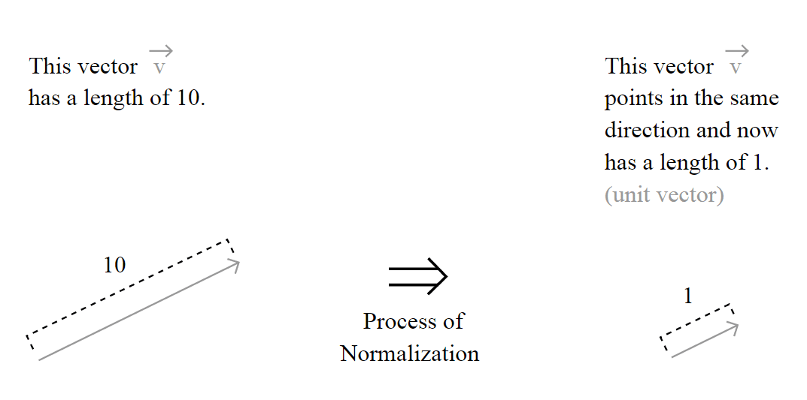
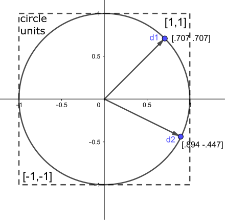
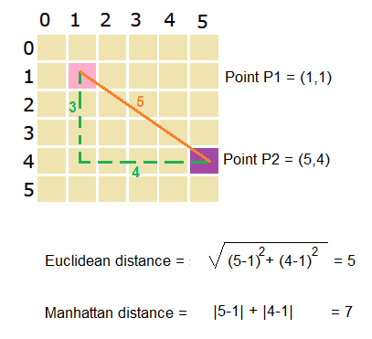

```{r setup, include=FALSE}

# Make sure every package is installed
for(this_package in c("data.table",
                      "tidyverse",
                      'lsa',
                      'Matrix',
                      "rstudioapi",
                      'magrittr',
                      'knitr',
                      'here',
                      'text2vec',
                      'rprojroot',
                      'ggplot2')){
  if(!this_package %in% installed.packages()){
    install.packages(
      this_package,
      repos = "http://cran.us.r-project.org")
  }
}
if(!'igraph' %in% installed.packages()){
  install.packages("igraph", type="binary")}

library(text2vec)
library(magrittr)
library(lsa)
library(Matrix)
library(data.table)
library(ggplot2)

knitr::opts_chunk$set(echo = TRUE)
here::i_am(path = 'scripts/3_bivariate_analysis.Rmd')

```

# Introduction

Distributional semantic models derive from the pragmatist and differential conception of meaning advocated by Harris' distributionalist linguistics, which conceives semantics on the basis of syntagmatic (neighbors) and paradigmatic (synonyms) relationships defined by the co-occurrence relationships between terms. within real linguistic contexts. This particular conception of semantics found its most succinct expression, known and cited in the distributional hypothesis, which states that "words that are found in similar contexts of appearance tend to have similar meanings" [@heylen2016, p.54]. These ideas were implemented for the first time in the SMART system, an information retrieval system based on the vectorization of lexical frequencies of documents in a corpus and the calculation of semantic similarity/distance relationships between vectorized documents on the basis of a modified version of the distributional hypothesis, stating that "documents with similar vectors in a textual frequency matrix tend to have similar meanings" [@turney2010, p. 153, free translation]. The vector modeling procedure developed for the SMART system, taken up, improved, deepened then extended by all the distributional semantic models developed since, will be the subject of this course segment.

# Information units and domains

We would like to mention here that since distributional semantic models are used in several domains and under a multiplicity of names, it is therefore hardly surprising that the terminology relating to them is just as diverse. As part of this course, we thought it would be good to introduce you to the terminology advocated for several years by the Cognitive Information Analysis Laboratory (LANCI) and its collaborators, terminology which also enjoys a long tradition in the information retrieval and linguistic literature, especially in French-speaking countries [@biskri2006; @collard2004; @collard2005; @biskri2010; @hajji2003; @ghedira2002; @gargouri2009; @chartier2010; @chartier2010b; @chartier2011; @meunier2005; @danis2012; @biskri2012; @biskri2013; @biskri2002; @saintemarie2011; @saintemarie2010; @forest2004; @forest2005]. This terminology is based on the use of two fundamental concepts of the semantic corpus modeling process, namely information units and information domains.

A concept from information and communication technologies, the information unit represents here the basic element of the vector modeling process, the one whose co-occurrence relationships will be recorded then compiled in the different cells of the frequency matrix. If the basic unit of information is undoubtedly the word, a host of other units can also be selected and modeled. The concept of information domain refers to the semantic context, in other words to the type of environment within which the co-occurrences between the chosen information units are recorded and compiled. In the case of the Salton SMART model, the basic information domain is the document, but many other types of domain are also possible: tweets, sentences, conversational or telephone interventions, paragraphs, pages or sites web, sections, chapters and so on. Taken jointly, units and domains of information thus form a very general theoretical framework, capable of covering most cases of use of distributional semantic models.

# Matrix Generation

Considered as a whole, distributional semantic modeling relies on the generation of two types of matrices, namely frequency matrices and similarity matrices. Firstly, each information domain of the corpus is searched and the frequencies between units co-occurring within it are compiled so as to obtain a lexical distribution for each information domain; then, a frequency matrix representing the overall distribution of information units within the different information domains of the corpus is generated. Based on the distinction between units and information domains presented above, four types of frequency matrices can be generated:

- Domain-unit (DU) matrix:
  - The vectorized entities are the information domains
  - Each vector (row) of the matrix represents a distinct information domain of the corpus
  - Each dimension (column) of a vector corresponds to a distinct information unit of the corpus
  - The value of each cell is based on the number of information units of the corresponding column within the information domain of the corresponding row
  - Any manipulation or comparison of vectors pertains to information domains
- Unit-domain (UD) matrix
  - The vectorized entities are the units of information
  - Each vector (row) of the matrix represents a distinct unit of information
  - Each dimension (column) of a vector corresponds to a distinct information domain of the corpus
  - The value of each cell is based on the number of information units of the corresponding row within the information domain of the corresponding column
  - Any manipulation or comparison of vectors pertains to information units
- Unit-unit (UU) matrix
  - The vectorized entities are the units of information
  - Each vector (row) of the matrix represents a distinct information unit
  - Each dimension (column) of a vector corresponds to a distinct information unit
  - The value of each cell is based on the number of co-occurrences of the unit of the corresponding row with the unit of the corresponding column within the different information domains
  - Information domains are not represented explicitly
  - The matrix is symmetrical
- Domain-domain (DD) matrix
  - The vectorized entities are the information domains
  - Each row (vector) of the matrix represents a distinct information domain
  - Each column (dimension) of a vector corresponds to a distinct information domain
  - The value of each cell is based on the number of distinct information units shared by the domain of the corresponding row and the domain of the corresponding column for all the information units present in the corpus
  - Information units are not represented explicitly
  - The matrix is symmetrical

From the generation of domain-unit and unit-domain frequency matrices, similarity matrices can subsequently be generated from the application of any similarity measure to each pair of vectors in the matrix. The result of this operation is a symmetric matrix with a structure similar to the unit-unit and domain-domain type frequency matrices presented above.

These two steps are not self-evident, however, since the accomplishment of each is based on prior parameterization choices. In the case of frequency matrices, it is a question of choosing not only the types of information units, information domains and frequency matrix to model, but also the type of frequency to compile; these can be raw frequencies, but also weighted frequencies, normalized frequencies and normalized weighted frequencies. Regarding the generation of similarity matrices, the main decision consists of the selection of a similarity measure to apply on all the vectors of the corpus. For each of these decisions, several options are available to the researcher, and the choice of a particular modeling strategy depends on several factors, including the type of corpus being modeled and the researcher's priorities and objectives. These different stages and modeling alternatives as well as the choices they imply will be addressed in the following sections.

The first step in the distributional semantic modeling process consists of the generation of frequency matrices. This course segment will be an opportunity for you to get a first introduction to the generation of frequency matrices, first of all, but also to take a more in-depth look at the *text2vec* library.

```{r import_corpus, results = 'hide'}

corpus <-
  readRDS(
    here::here('data/processed',
               'tagged_corpus_with_metadata.RDS')) %>%
  data.table::setDT(.) %>%
  .[!is.na(paragraph_id)] %>%
  .[, .(tokens = paste(token, collapse = ' ')), by = .(id)]


```

While documents in PDF format take up more disk space than their equivalent in text format, co-occurrence matrices are nevertheless the least voracious textual data structures, given their sparse nature. However, as R creates a copy of an object before each modification (**copy-on-modify semantics** in English), generating a textual matrix can be costly in both time and processing space. Indeed, the entire corpus must be recorded in working memory prior to the creation of the vectors, which can double and even quadruple the amount of memory used for vectorization. To overcome this problem, the *text2vec* package offers an interesting strategy, based on the use of iterators. We will see what this consists of later.

Let's start with a review of the vectorization process presented at the end of the course on pre-processing. In linear algebra, a vector is an ordered set of values ​​describing the relative positioning of a point in a space, at the rate of one value per dimension of this space. In this sense, vectorizing a corpus consists of a sort of quantification of its textual content. This quantification is obtained by the segmentation and extraction of units and domains of information from the corpus, which are then used to define the vectors and dimensions of this space, or vice versa.

The *itokens* function of the *text2vec* library allows you to iterate over the lexical tokens of the corpus. For your information, all *text2vec* functions whose name begins with *create* rely on the use of iterators created by the *itokens* function, iterators allow spatially frugal generation of data structures. The *itokens* function also includes a series of arguments allowing pre-processing operations (*preprocessing* arguments), segmentation (*tokenizer* argument) and partitioning (*nchunks*) operations to be carried out on the fly. ; however, they will not be discussed here.

```{r iterator}

iter <- text2vec::itoken(corpus$tokens, 
                         ids = corpus$id,
                         progressbar = FALSE)

```

One of the iterative functions of *text2vec*, *create_vocabulary* allows you to extract lexical types from the document one by one, assign them a unique identifier and generate their statistical distribution. As part of this demonstration, we will use as a unit of information the terms contained in the *token* column of the *titles* file. Another function of *text2vec*, *prune_vocabulary*, allows you to perform additional pruning of lexical types in the corpus on an effective (count) or frequency (proportion) basis. To the extent that very or very infrequent terms do not constitute good statistical discriminators, this type of pruning makes it possible to reduce not only the statistical noise, but also the size of the lexicon and that of the resulting frequency matrix, which can result in significant performance gains. In the present case, we decided to keep any unit of information appearing at least twice in the corpus (argument *term_count_min*) as well as those appearing in at least two different domains (argument *doc_count_min*).

```{r lexicon, results = 'hide'}

lexicon <-
  text2vec::create_vocabulary(iter,
                              ngram=c(ngram_min = 1,
                                      ngram_max = 1))

lexicon <-
  text2vec::prune_vocabulary(
    lexicon,
    term_count_min = 2,
    term_count_max = Inf,
    doc_proportion_min = 0.0001,
    doc_proportion_max = 0.5,
    doc_count_min = 5,
    doc_count_max = Inf,
    vocab_term_max = Inf) %>%
  data.table::setDT(.)

lexicon

```


## Domain-unit matrix

Different matrix generation procedures make it possible to transpose the corpus into a vector space. The first type of matrix, the oldest, constitutes a generalization of the SMART vector model implemented by Gerard Salton and his colleagues [@salton1975]. To generate this type of matrix, it suffices to convert each information domain into a vector and each distinct information unit of the corpus into the dimension of the vector space, then to assign, for each dimension unit of each domain vector , the value corresponding to the number of times the corresponding unit appears in the domain in question. In this type of matrix, co-occurrence relationships between units are not represented explicitly, but are indirectly present in the co-inclusion of units within domains.

After building the vocabulary, the *vocab_vectorizer* function allows you to create an object defining the procedure for converting lexical types into indices or matrix dimensions. The *ngram* parameter of this function allows you to specify the type of n-grams of words to consider. Finally, the *create_dtm* function uses this lexical vectorizer and the iterator created previously to generate a domain-unit frequency matrix.

```{r du_matrix, results = 'hide'}


vectorizer <- text2vec::vocab_vectorizer(lexicon)

du_matrix <- text2vec::create_dtm(iter,
                                  vectorizer,
                                  type = "dgCMatrix")
str(du_matrix)

```

The data structure of the matrix, inherited from the *Matrix* library, is of type *dgCMatrix* (for **digital** ). The product file contains 6 boxes (**slots**). *Dim* contains the dimensions of the matrix, with 6424 document rows and 542 column terms. The *x* box gives the non-zero values of the matrix in column order (top to bottom, then left to right). Box *i* gives the row index for each value in box *x*, while box *p* is the cumulative sum of non-zero values per column; this system allows you to avoid specifying the column index of each non-zero value; in the case of large matrices, this system allows much more economical encoding. Finally, the *Dimnames* box returns the names of the rows (here, the documents) and the columns (here, the terms) of the matrix. The following tests allow you to check whether the order of documents and terms is respected.

```{r names_test}

identical(rownames(du_matrix), as.character(corpus$id))
identical(colnames(du_matrix), lexicon$term)

```

A glimpse of the matrix can be shown by calling the object itself

```{r view_du, results = 'hide'}

du_matrix

```

## Unit-Domain Matrix

If the SMART model of Salton and his colleagues essentially had the function of measuring the similarity between information domains of a corpus, it is also possible to use the same modeling technique for the semantic processing of information units (words, lemmas, lexical types, lexical occurrences, n-grams of characters or words, noun phrases, etc.) [@deerwester1990]. Unit-domain matrices can be obtained simply by transposing domain-unit matrices using the *t()* function of the *Matrix* library. This function generates a new matrix whose rows correspond to the columns of the previous one and vice versa.

```{r ud_matrix, results = 'hide'}

ud_matrix <- Matrix::t(du_matrix)
ud_matrix

```

Representing each distinct unit of the corpus as a vector whose dimensions correspond to distinct information domains generates allows for comparisons between and operations on information units. Most of the applications of this type of model concern the semantic processing of words. If the oldest and known of them aim to carry out different synonymous tasks [@deerwester1990; @landauer1997; @rapp2004], unit-domain matrices have also proven their usefulness in different classification and grouping tasks, notably for semantic labeling purposes [@erk2007; @pennacchiotti2008; @turney2003], sentiment analysis, automatic thesaurus generation [@crouch1988; @grefenstette2012] [@ruge1997; @pantel2002; @curran2002] and lexical disambiguation [@schutze1998; @pantel2002; @pereira1993; @agirre2007; @pedersen2007; @leacock1993; @yuret2010].

## Unit-Unit Matrix

The third type of matrix is generated by calculating the matrix product of the unit-domain matrix by its transpose, the domain-unit matrix. This operation can be done in two ways, both using the *Matrix* library: the first is to use the operator _%\*%_ on the unit-domain and domain-unit matrices in order; the second, faster, consists of applying the *tcrossprod()* function, which performs the matrix product of a matrix and the transpose of a matrix, which correspond in the present case to the unit_domain matrix.

```{r tcrossprod_test}

identical(as.matrix(ud_matrix %*% du_matrix),
          as.matrix(Matrix::tcrossprod(ud_matrix)))

```

```{r u_u_matrix, results = 'hide'}

uu_matrix <- Matrix::tcrossprod(ud_matrix)
uu_matrix

```


The result is a matrix having as rows and columns the different units of information present in the corpus and whose values represent the number of times where two units of information co-occur within the different information domains of the corpus. In this type of matrix, co-occurrence relationships are represented explicitly. What is no longer there, however, are the inclusion relations of the units in the different information domains of the corpus, these being absent from the model.

We will use this type of matrix as part of the script on co-occurrence networks.

## Domain-Domain Matrix

The fourth type of matrix, much less known and used, can be generated through the matrix product of the domain-unit by the domain-unit matrix. This operations results in the creation of a domain-domain matrix, whose values express a co-inclusion relationship and correspond to the number of terms shared by two information domains.

```{r d_d_matrix, results = 'hide'}

dd_matrix <- Matrix::tcrossprod(du_matrix)
dd_matrix

```

By indicating the number of information units shared by two documents, domain-domain matrices allow a first approximation of their semantic similarity. However this kind of comparison is rough at best, for a few reasons. First, every domain has itself as its most similar domain; in other words, the highest values in the whole matrix are to be found on the matrix diagonal. While this feature enables us to know how many tokens are included in each domain, it is devoid of any semantic value. Another problem is that similarity comparisons based on absolute counts fails to control for document size, though one way to deal with this would consist in dividing each row by its corresponding diagonal value. A bigger problem however, is that the distribution of information units throughout the different information domains is almost never the same: some occur more often, some less, which means that the informativeness of the co-inclusion of an information unit in two distincts domains entirely depend on how frequent it is elsewhere in the corpus. Varying frequency weighting and standardization procedures have been developed to deal with these challenges, some of which will be presented in the next section.

# Weighting

A problem endemic to lexical distributions is related to their asymmetric nature: regardless of the unit type and information domains chosen for a model, the vast majority of unit occurrences are always the case of a minority of types. This problem may be familiar to you; in fact, it is related to "Zipf's law". With regard to modeling based on frequency counts, this distributional asymmetry means that regardless of the model, a minority of cells in the frequency matrix will necessarily share the majority of the observed numbers. In this sense, the most frequent units will tend to appear in most of the domain; in the context of differential semantics, this means that such units represent more noise than information.

Matrix weighting aims to remedy to this situation by adjusting the weight of each unit according to its informational content. To the extent that surprising events shared by two vectors are better discriminators in terms of similarity than more frequent events, the weighting procedures aim to modify the unit numbers of each vector on the basis of the frequency of these units in the rest of the corpus.

The most well-known weighting technique used in the field of distributional semantic modeling is undoubtedly tf-idf (for *term frequency x inverse document frequency*). Designed by Karen Spärck Jones [-@sparck1972], tf-idf consists of normalizing the frequency of occurrence of each term within the domains of a corpus on the basis of its inverse document frequency (**inverse document frequency or IDF**). This indicator is based on the idea that the importance or informativeness of a term is inversely proportional to its presence in the entire corpus. Formally, the IDF aims to give greater weight to the least frequent terms by calculating, for each unit of the lexicon, the logarithm (in base 10 or base 2) of the inverse of the proportion of domains in the corpus containing the term:

\[IDF = \log {\frac  {\textrm{# domaines du corpus}}{\textrm{# domaines du corpus contenant l'unité}}}\]

By multiplying the frequency of each unit within each domain by the corresponding IDF value, the tf-idf thus makes it possible to adjust the weight of a unit within a domain according to its informativeness relative to the corpus analyzed. Salton and Buckley [-@salton1988] defined a large family of tf-idf type weighting functions and demonstrated that their use in weighting frequency matrices offers several advantages over raw headcounts.

The *text2vec* package allows you to weight a frequency matrix by creating a *tf-idf* model using the eponymous function.

```{r tfidf}
tfidf_model <- text2vec::TfIdf$new(smooth_idf = FALSE,
                                   norm = 'none',
                                   sublinear_tf = FALSE)

```

As its name indicates, the *smooth_idf* argument makes it possible to soften the distribution of *tf-idf* scores by incrementing the inverse documentary proportion by one, as if the corpus containing an additional domain containing each unit of the lexicon only one times:

\[IDF = \log{\Bigg(1+\frac{\textrm{# corpus domains}}{\textrm{# corpus domains where the term appears}}\Bigg)}\]

As for the *norm* argument, we will return to it in the next section Finally, the *sublinear_tf* argument allows you to soften the unit count (*term_frequency* or **tf**) by means of sublinear scaling $1 + log(tf)$. For now, let's assign the value *none* to *norm* as well as the value *FALSE* to the other two parameters, which will not be discussed here.

# Normalisation

Among the problems facing computer-assisted text analysis, those caused by differences in size between information domains in the same corpus are among the oldest, recurring and stubborn. Regardless of the corpus as well as the type of information domain chosen, very few modeled domains are of the same length; some of them can be much larger than others and thus have more extensive vectors than those representing contexts of smaller size. However, given the differential nature of vector semantics, such a size variation can have an effect on distance calculations and distort your distance matrix, a bit like distorting mirrors. It has also been shown in information retrieval that search engines have a favorable bias towards longer documents [@singhal1996].

A term with multiple meanings and uses, the term "normalization" generally refers in mathematics, statistics and metrology to various procedures for adjusting values ​​for the purposes of standardization or with a view to conferring representativeness and good form to the data. In the field of linear algebra, however, the term refers to a particular operation, consisting of assigning an extent or length to the various elements of a vector space. Formally, a norm is a function which assigns a positive real to a vector on the basis of certain formal properties (absolute homogeneity and triangular inequality), except for the zero vector, which is assigned a zero value (0).

The concept of norm is of great importance in distributional semantic modeling as in computer science in general. Remember that a semantic-vector space constructed based on the principles and procedures presented so far is a set of points in a multidimensional space; we represent them by straight lines or arrows for reasons of understanding and visibility, but they are not part of this space in its raw form. To include them, it is necessary to standardize this space, in other words to provide it with a function allowing a magnitude to be assigned to the vectors it contains and which makes it possible to know its length and direction and thus to measure it. If the length of a vector does not matter to us -- in fact, this is precisely what we want to neutralize given the inequality in size of the information domains in our corpus -- it is quite another matter the direction, because it is this which indicates to us the "meaning" (pardon the pun) of our vector, the sector of the semantic space towards which it tends. However, to isolate this vector direction, it suffices to convert the vectors populating the space into unit vectors, that is to say into co-linear vectors (in the same direction as the original vector) whose norm has a length of 1.



Formally, the normalized vector $\hat{u}$ of a non-zero vector $u$ is the unit vector co-linear with $u$ and obtained as follows:

\[\mathbf {\hat {u}} ={\frac {\mathbf {u} }{|\mathbf {u} |}}\],

where $|u|$ is the norm (or length) of $u$. The term "normalized vector" is often used interchangeably with "unit vector". In other words, to convert a vector into a unit vector (or direction vector), it is simply necessary to divide it by its norm, in other words to divide each of the values ​​of its non-zero dimensions (each coordinate) by the length of the vector.

In the context of distributional semantics, the use of unit vectors makes it possible to neutralize the effect of domain size. Since all vectors are at the origin and the length of each vectorized domain is the same, the only remaining element for calculating similarity is the distance resulting from the difference in direction, as in the following example.

{style="display: block; margin: 0 auto"}

Obviously, the type of unit vector space obtained depends on the norm chosen. Theoretically, there are an (uncountable) infinity of ways to normalize a vector space. This infinity is well highlighted by the Minkowski metric, a parametric equation generalizing the mathematical concept of norm:

\[\left(\sum _{i=1}^{n}|x_{i}-y_{i}|^{p}\right)^{\frac {1}{p}}\]

The infinity of normalization possibilities results from the infinity of values attributable to the parameter *p* (non-countable infinity in the case of real numbers). Fortunately, for distributional semantic models and most computer applications, two norms are generally used: the rectilinear norm (L1), for which $p=1$, and the Euclidean norm (L2), $p=2$.

Used in regression analysis since the 18th century, the rectilinear norm, also called Manhattan norm, City-Block norm, taxicab norm, represents the 1-distance (for $p=1$) derived from the Minkowski metric and corresponds to the sum of absolute differences of all coordinates of the compared vectors:

\[\left(\sum _{i=1}^{n}|x_{i}-y_{i}|^{p\rightarrow1}\right)^{\frac {1}{p\rightarrow1}} = \sum^{n}_{i=1} | x_i - y_i |\]

The different names of this measurement allude to the grid structure of the space thus standardized: this norm in fact assigns magnitudes to the vectors or to each other in a manner which is reminiscent of the trajectory followed by vehicles within of the Hippodamian or checkerboard structure of modern urban cities, made of right angles and perpendicular segments.

More used than the previous one, the Euclidean distance or L2 norm represents the 2-distance (for $p=2$) derived from the Minkowski metric and corresponds to the application in a vector context of the Pytagorean theorem. This theorem, probably one of the best known in all of mathematics, relates the lengths of the sides in a right triangle. It states that the square of the length of the hypotenuse, which is the side opposite the right angle, is equal to the sum of the squares of the lengths of the other two sides. The formal version of this theorem, called the "Pythagorean equation", is written as follows:

\[a^{2}+b^{2}=c^{2},\]

where $c$ represents the length of the hypotenuse and $a$ and $b$ the lengths of the other two sides of the triangle.

This theorem has been the subject of numerous proofs and geometric or algebraic extensions over time, probably more than any other theorem. In a vector and semantic-vector context in particular, it makes it possible to measure space by treating any pair of vectors and the length that unites them as Pythagorean triples:

\[d(x,y)=\left(\sum _{i=1}^{n}|x_{i}-y_{i}|^{p\rightarrow2}\right)^{\frac {1}{p\rightarrow2}} = \sqrt{\sum^{n}_{i=1} (x_i - y_i)^2 }\]

The difference in the calculation of the two standards is well illustrated by the following example:

{style="display: block; margin: 0 auto"}

Each in their own way, these two standards allows to convert a vector space into a unit vector space, by transforming each vector by division into a vector with the same direction and length 1, as defined by the standard in force. The *text2vec* library allows you to normalize the frequency matrices previously generated using "l1" or "l2" in two different ways: using the *normalize* function or by modifying the normalization parameter of the *tfidf* transformer previously described.

Finally, the order in which weighting and normalization are presented here in succession is very important. Indeed, weighting must always be carried out BEFORE normalization, for a simple reason: to the extent that normalization converts all vectors into unit vectors in order to neutralize variation in the size of information domains, weighting vectors after normalizing them only ruins the vector length normalization process.

The *Tfidf* transformer of the *text2vec* library makes it possible to avoid such an error, to the extent that the *norm* parameter of this transformer allows unitary normalization to be carried out automatically.

To sum up, a weighted and then normalized domain-domain matrix allows a finer measurement of the semantic similarity between information domains. In this sense, it represents an improvement of the frequency counting modeling process explicited here by the domain-domain matrices. The use of the term “measurement” here is not innocent, as the generation of a domain-domain matrix by means of the matrix product of l2-normalized domain-unit and unit-domain matrices is mathematically equivalent to computing cosine similarities between the different rows of a domain-unit matrix. In this sense, weighting and normalization procedures are intimately linked to the choice of similarity measures. In the following section, we will focus on 

# Similarity matrices

The linguistic distributionalism of Zellig Harris, from which distributional semantic models are inspired, advocates a differential and non-referential conception of semantics. According to this interpretation, the signifying function of a word does not rest on a direct and abstract relationship of correspondence with the world of ideas and concepts, but rather is based on syntagmatic and paradigmatic relationships, which emerge from co-occurrence relationships. resulting from the sequential development of the linguistic chain and determine the meaning of a word through its use, either from the other words forming its context of occurrence as well as those that can be substituted for it at this precise location in the chain respectively. In other words, a word means nothing in itself, because our utterances and the words that compose them only convey meaning collectively, in relation to each other: the meaning is not “in” the words, but “between” them.

Placing emphasis on the semantic differential of course gives importance to the concepts of semantic similarity. In this perspective, domain_unit and unit_domain frequency matrices created from a corpus and by means of the procedures specified in the previous segment configure a vector space, but it is only by providing it with a function allowing to measure the similarity between the different vectors that compose it that the structural isomorphism between the relationships of lexical co-occurrence and semantic similarity is properly operationalized.

The following segment will focus on the generation of similarity matrices based on the use on domain-unit and unit-domaine matrices of the best-known and most used metric in computational text analysis and perhaps in computer science in general: the cosine.

### Cosine

The law of cosines, also called Al-Kashi theorem or generalized Pythagorean theorem, is a classic element of geometry commonly used in trigonometry, allowing the length of one side to be known from those of the other two and the cosine of the angle formed by these two sides.

\[a^{2}+b^{2}-2ab\cos \theta = c^{2}\]

However, by resorting to the Cauchy-Schwartz inequality, stipulating that the absolute value of the scalar product of two vectors in ${\rm I\!R}^n$ is always less than the multiplication of their norms, this law finds a direct application in vector algebra. Given two vectors $\textbf{x} = \left \langle x_1, x_2, ..., x_n \right \rangle$ and $\textbf{y} = \left \langle y_1, y_2, ..., y_n \right \rangle$ each with **n** dimensions (which represent the **n** columns of the frequency matrix and therefore the **n** dimensions from which the units of information are compared with each other to the others), the cosine of the angle $\theta$ formed by these two vectors at the origin is equal to the scalar product of their Euclidean norm ($L2$):

\[cos(x,y) = \frac{\sum^{n}_{i=1}x_i \cdot y_i}{\sqrt{\sum^{n}_{i=1}x^2_i} \cdot \sqrt{\sum^{n}_{i=1}y^2_i}}\]

The cosine is thus based on the angle of the vectors and not their length, which prevents large values from influencing similarity comparisons and slowing down processing time [@turney2010; @clark2015]. The cosine values vary between -1 and +1, i.e. when the compared vectors point respectively in opposite directions (the angle $\theta$ formed by the two vectors is $180^{\circ}$) and identical ( the angle $\theta$ formed by the two vectors is $0^{\circ}$); when the two vectors are orthogonal (the angle $\theta$ formed by the two vectors is $0^{\circ}$, the cosine is 0. It is important here to mention that in the case of raw frequency counts , vectors cannot have negative elements, so that the cosine cannot itself be negative. However, this cannot always be the case: in the case of the use of certain weighting and dimensional reduction functions (. which will be presented to you later), the use of certain functions can result in the introduction of negative elements, which therefore makes it possible to calculate negative cosine values.

In the previous script, we saw, on the one hand, that the calculation of the cosine between two vectors corresponds to the vector product of their Euclidean norm (L2) and, on the other hand, that the calculation of the vector product between each vector of domain-unit and unit-domain frequency matrices are respectively equivalent to the generation of domain-domain (we are talking here about the last matrix generated in the previous script) and unit-unit frequency matrices, respectively. In this sense, the cosine similarity between different vectors of l2-normalized unit-domain and unit-domain frequency matrices can be obtained by means of a simple matrix product, saving both time and space in the context of generating similarity matrices for high-dimensional vector spaces [@manning1999]. The case of the l2-normalized domain-domain matrix having already been treated in the previous script, let us focus on the case of the cosine similarity matrix between the different weighted unit vectors of the unit-domain frequency matrix of the subcorpus titles.

```{r cosinus, results = 'hide'}

tfidf_model <-
  text2vec::TfIdf$new(smooth_idf = FALSE,
                      norm = 'none',
                      sublinear_tf = FALSE)

cosine_matrix <-
  text2vec::create_dtm(
    iter,
    text2vec::vocab_vectorizer(lexicon),
    type = "dgCMatrix") %>%
  Matrix::t(.) %>%
  text2vec::fit_transform(., tfidf_model) %>%
  text2vec::normalize(., norm = 'l2') %>%
# Computing cosine similarity through the matrix product of the l2-matrix with its transpose
  Matrix::tcrossprod(.)
cosine_matrix

```

Several other (dis)similarity measures have been proposed and used in the field of computer-assisted text analysis [@bannour2012; @curran2003; @bullinaria2007; @kiela2014; @manning1999]. Like the cases presented here, these different distance measurements and the results they obtain often have very little resemblance. Given these differences, several studies have attempted to evaluate the performance of these measures in different task types and contexts [@lin1998;@curran2002;@plas2004;@strehl2002;@lee1999;@weeds2004;@bullinaria2007]. Beyond this literature, however, it is difficult to determine which measure of similarity is best. The choice of a (dis)similarity measure is likely to depend as much on the task performed, the type of relationships considered, the dispersion of the data and the frequency distribution of the elements compared as on the matrix smoothing method adopted [@clark2015].

# Cooccurence Networks

To finish this course segment on distributional semantic models, the next script will introduce you to a particular mode of visual representation of these models: co-occurrence networks.

In previous scripts, we saw how to generate, weight, normalize, and transform different types of text matrices for semantic analysis purposes. However, such matrices do not represent the only way to visualize distributional data. This script consists of a brief introduction to a second mode of representing textual data: graphs. The representation of textual data in reticular form (i.e. networks, graphs) is widely used and documented within the different disciplines interested in computer-assisted text analysis [@morardo2014; @claveau2014]. Two types of networks can be constructed based on the matrices generated in this course segment. The first consists of representing in the form of a network similarities between information domainss: in this visualization mode, each domain is represented by a node and each link by a similarity ratio between two domains, the thickness of the link being proportional to their similarity. In the context of this course, however, we will be interested in the second type of network, namely co-occurrence networks. In these networks, each node corresponds to a different information unit, and edges indicate the existence of one or more co-occurrences between connected nodes.

Like differential semantics, such networks are based on the idea that frequent associations between information units within the information domains of a corpus are indicative of semantic (syntagmatic) synergies. However, co-occurrence networks are particular in that they represent these semantic relationships visually, with edges whose thickness is proportional to some sort of similarity measure.

However, due to dimensionality problems caused by the large number of different units within a corpus, it is generally impractical to generate the co-occurrence network of the latter in its entirety: although it is possible to generate and explore such a network using specific visualization tools, it is generally impossible to present them as such in a text or as part of a presentation. From this perspective, the generation and visualization of co-occurrence networks is generally preceded by operations making it possible to reduce the corpus and lighten the network obtained, thus allowing easier access to the semantic relationships that emerge (Heylen, Speelman & Geeraerts 2012, heylen2016). Two types of reduction can be used. First of all, it is possible to carry out a tighter filtering of a corpus so as to reduce the dimensionality of the frequency and similarity matrices and therefore the number of vertices and edges of the co-occurrence network. A second approach, on a smaller scale, consists of generating the co-occurrence network of the concordance of one or more words in the corpus. We will focus here on the second approach.

The second approach to visualizing co-occurence networks relationships involves reducing the data to be represented by extracting and visualizing concordances. As an example, let's visualize the co-occurrence relationships between documents containing the substring "aarhus". Let's start by generating a new cosine similarity matrix, and then convert it into an adjacency matrix and a graph using the package *igraph*.

```{r unité_concordance, results = 'hide'}

conc_subcorpus <-
  corpus[tokens %like% 'aarhus']

iter <- text2vec::itoken(conc_subcorpus$tokens,
                         ids = conc_subcorpus$id,
                         progressbar = FALSE)

lexicon <-
  text2vec::create_vocabulary(iter,
                              ngram=c(ngram_min = 1,
                                      ngram_max = 1)) %>%
  text2vec::prune_vocabulary(.,
                             term_count_min = 10,
                             term_count_max = Inf,
                             doc_proportion_min = 0.001,
                             doc_proportion_max = 0.5,
                             doc_count_min = 2,
                             doc_count_max = Inf,
                             vocab_term_max = Inf) %>%
  data.table::setDT(.)

tfidf_model <- text2vec::TfIdf$new(smooth_idf = FALSE,
                                   norm = 'none',
                                   sublinear_tf = FALSE)

cosine_matrix <-
  text2vec::create_dtm(
    iter,
    text2vec::vocab_vectorizer(lexicon),
    type = "dgCMatrix") %>%
  Matrix::t(.) %>%
  text2vec::fit_transform(., tfidf_model) %>%
  text2vec::normalize(., norm = 'l2') %>%
# Computing cosine similarity through the matrix product of the l2-matrix with its transpose sa transposée
  Matrix::tcrossprod(.) %>%
  igraph::graph_from_adjacency_matrix(., mode = "upper", weighted = 'weight') %>%
  igraph::simplify(.,
           remove.multiple = TRUE,
           remove.loops = TRUE)
plot(cosine_matrix,
     edge.width = igraph::E(cosine_matrix)$weight,
     layout =
       igraph::layout.fruchterman.reingold)

```

# References